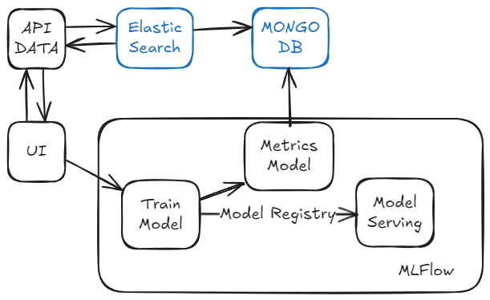

# mlops
## Partie 1 
4) J'utilise Nginx pour simplifier l'utilisation des requêtes API, cela permet de ne pas exposer les ports dans mes endpoints.
Il permet aussi de créer un seul endpoint sur plusieurs instances du même service ainsi les requêtes vont être distribué sur chacunes des instances. (exemple : 50 requêtes API en attente sur le même endpoint, Nginx va distribué équitablement ou pas sur toutes les instances du service_a pour effectuer les requêtes). 
5) Je n'utilise pas Kubernetes (Minikube) pour plusieurs raisons :
    -le projet n'est pas assez grand, j'ai uniquement 4 services.
    -je n'ai pas prévu de le déployer sur un cloud, cela aurait été pertinent d'utilise Minikube pour simuler Kubernetes
    en local puis Kurbenetes sur le cloud mais mon projet est uniquement en local.

## Partie 2
J'ai initialisé une base de donnée test et une collection test_collection dans init-mongo.js.
Ensuite, j'ai découpé l'architecture en deux services :
    -le service_a me sert de UI pour l'affichage.
    -le service_b me sert de API pour intéragir avec la base de donnée.
J'ai ajouté mongo-express pour visualiser la base de donnée sur le port 8081.
J'utilise un système d'authentification avec JWT pour gérer les accès entre les deux rôles USER et ADMIN.
Pour se connecter :
    Avec le rôle USER: 
        username : user, 
        mdp : user
    Avec le rôle ADMIN: 
        username : admin,
        mdp: admin

## Partie 3

Pour répondre à cette problématique, je ferai l'architecture suivante :
    -UI : d'afficher les données brutes à annoter + faire du monitoring des métriques et logs des modèles.
    -API DATA : une API permettant d'interagir avec Elastic Search pour ajouter,modifier,supprimer et récupérer des annotations.
    -Elastic Search: Interagit avec la base de donnée MONGODB je l'utilise car j'aurai beaucoups de données.
    -MongoDB: Stocker les données brutes (annotations+ métriques et logs des modèles).
    -Train Model: Entraine un modèle choisit dans l'UI, s'occupe aussi du versionning.
    -Model Serving: Récupère tous les modèles et leurs versions puis choisi lequel mettre en production, permet aussi de faire
                    des prédictions.
    -Metrics Model: Récupère tous les résultats de l'entrainement du modèle et les ajoutent dans la base de donnée MongoDB.
En résumé, je reprenderai ce que j'ai fait de la partie 2 pour l'UI+API DATA+MongoDB et je rajouterai Elastic Search puis
le système MLFlow que j'ai mis dans le projet BIG DATA/MlOps.